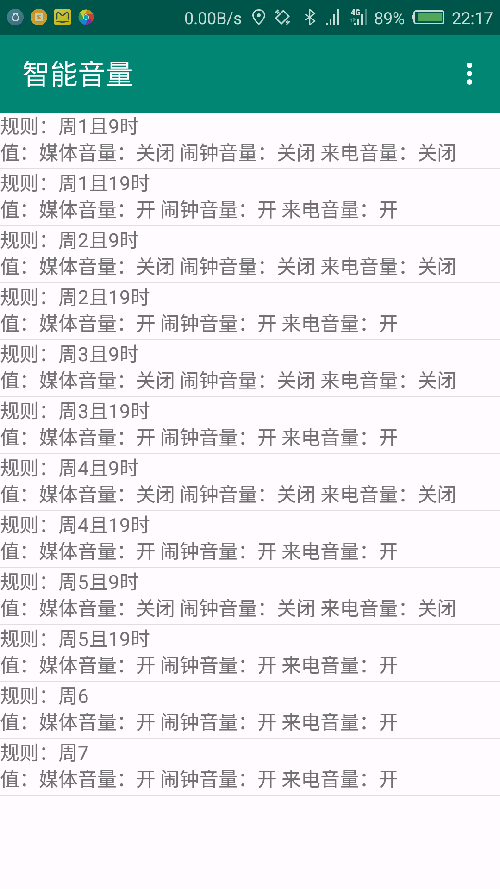

# AutoAudio
> 安卓音量管理工具

### 下载

[APK程序下载](https://github.com/jiangwei1995910/AutoAudio/releases)

### 初衷

上班狗、大学狗专用音量管理工具，设置好上班上课时间，上班上课期间自动改变手机音量，下班下课自动恢复音量。为你解决上课开会突然手机响，下班下课错过铃声的烦恼。

### 功能介绍：

1.设置时间段音量，比如接下来一小时的音量情况

2.按自定义规则自动改变设置音量

### Other

待完善:

1.监听音量键，对音量变化做出响应

2.监听音量变化广播，做出响应

3.自用小程序，界面待优化